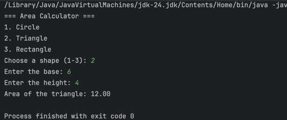

## Lab 4: Area Calculator
Write a Java program that calculates the area of different shapes using methods/functions.
Your program should be able to compute the following:

The area of a circle

The area of a triangle

The area of a rectangle

## Sample Outputs

### Circle

### Triangle

### Rectangle

